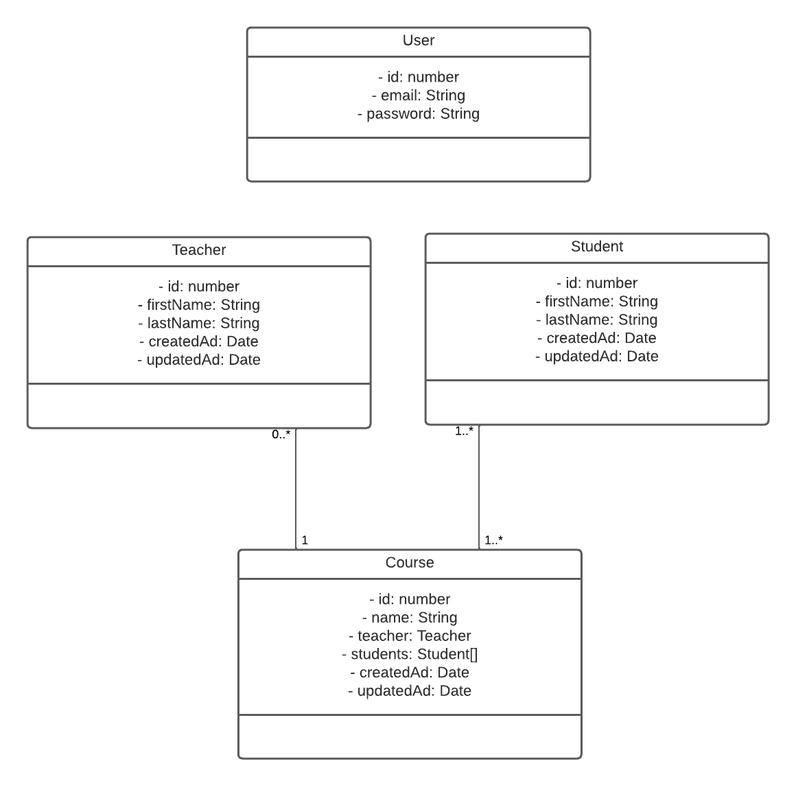

# Language academy backend

Proyecto de backend donde se desarrolla una API para una academia de idiomas.

## Herramientas utilizadas destacadas
- NestJs, NodesJs, Typescript
- SQLite


## Inicialización

### Instalación

```bash
$ npm install
```

### Inicializa la app

```bash
# development
$ npm run start

# watch mode
$ npm run start:dev

```

## Test

```bash
# unit tests
$ npm run test
```

## Documentación

Swagger: http://localhost:3000/api

Se construye un modelo de base de datos relacional con SQLite con la siguiente estructura donde se han insertado varios valores:



La API desarrollada permite:

Auth/User:
- Registro de nuevo usuario
- Login

Estudiante: 
  - Ver un estudiante dado un id
  - Ver todos
  - Editar 
  - Borrar
  - Crear
  - Añadir a un curso

Profesor: 
- Crear 
- Ver todos
- Editar
- Borrar

Cursos: 
- Ver todos
- Buscar los cursos que tiene un estudiante


Todos los endpoints están protegidos usando JWT excepto los referentes a la 
autentificación.

